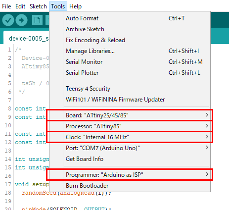
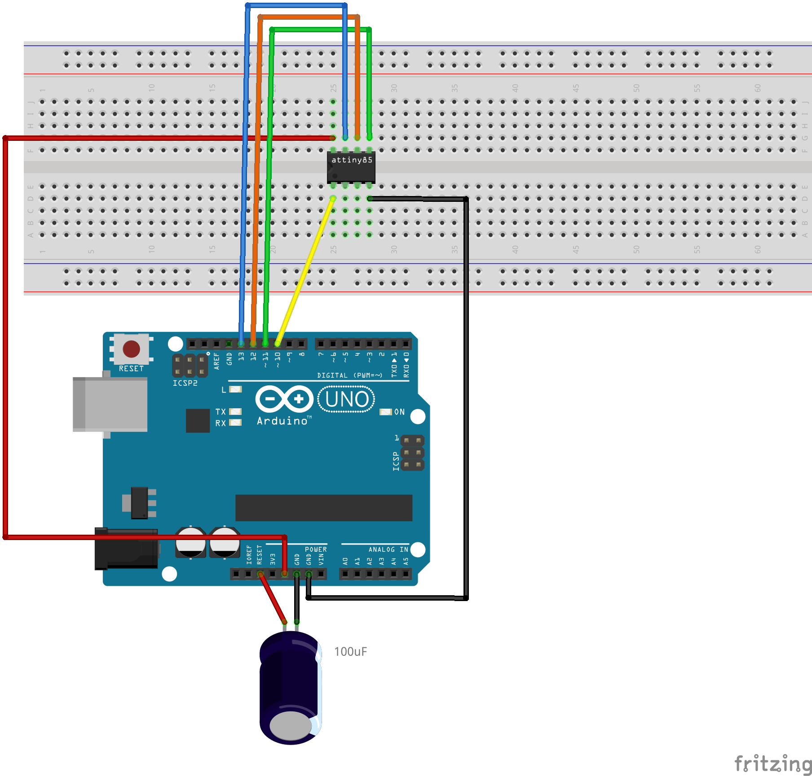

# Device-0005 / Solenoid Noise Machine (WIP)
An ATtiny85 based random can kick noise maker

## Schematic

## Arduino Config

The following procedure description is also very helpful:  
https://www.instructables.com/How-to-Program-an-Attiny85-From-an-Arduino-Uno/

## Connection diagram between Arduino and ATtiny85

## LICENSE
[MIT License](./LICENSE)